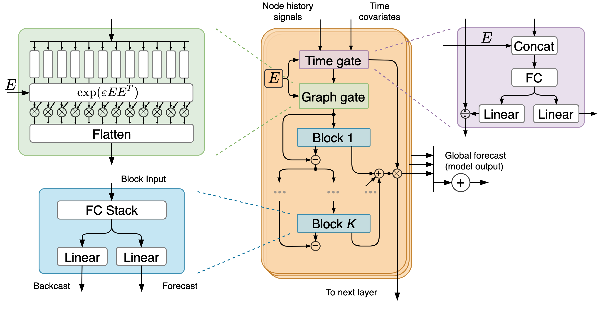

# <div align="center"> FC-GAGA: Fully Connected Gated Graph Architecture for Spatio-Temporal Traffic Forecasting </div>

<div align="center">

[](https://github.com/zezhishao/BasicTS)
[](https://github.com/cnstark/easytorch)

Pytorch code for AAAI'21 paper: "[FC-GAGA: Fully Connected Gated Graph Architecture for Spatio-Temporal Traffic Forecasting](https://arxiv.org/abs/2007.15531)".
Offical code:"https://github.com/boreshkinai/fc-gaga"

The code is developed with [BasicTS](https://github.com/zezhishao/BasicTS), a PyTorch-based benchmark and toolbox for time series forecasting.
</div>



## Note
1.The result is not good as origin code.It will increase 10% MAE now.  
2.I don't use the same hyper-parameters as origin code. Because when i use the same hyper-parameters, it will appear gradient exploding(epsilon=10).   
3.I don't use the same LR_SCHEDULER as origin code.  
4.These problem will be address after 2 months because i am busy now.If
you can address now, i will appreciate you.(谢谢)  

## Citing

This version of implementation is only for learning purpose. For research, please refer to and cite from the following paper:

```
@inproceedings{
  oreshkin2020fcgaga,
  title={{FC-GAGA}: Fully Connected Gated Graph Architecture for Spatio-Temporal Traffic Forecasting},
  author={Boris N. Oreshkin and Arezou Amini and Lucy Coyle and Mark J. Coates},
  booktitle={AAAI},
  year={2021},
}
```

##  Requirements

The code is built based on Python 3.9, PyTorch 1.12.0,  [EasyTorch](https://github.com/cnstark/easytorch) and [BasicTS](https://github.com/zezhishao/BasicTS).

After ensuring that PyTorch is installed correctly, you can install other dependencies via:

```bash
pip install -r requirements.txt
```

##  Data Preparation

### **Download Raw Data**

The code is now refactored based on [BasicTS](https://github.com/zezhishao/BasicTS),and you can get kinds of datasets from it. Then  unzip them to `datasets/raw_data/`.

### **Pre-process Data**

You can pre-process all data via:

```bash
cd /path/to/your/project
bash scripts/data_preparation/all.sh
```

Then the `dataset` directory will look like this:

```text
datasets
   ├─METR-LA
   ├─METR-BAY
   ├─PEMS04
   ├─raw_data
   |    ├─PEMS04
   |    ├─PEMS-BAY
   |    ├─METR-LA
   ├─README.md
```

##  Train

```bash
python step/run.py --cfg='model/fc-gaga_$DATASET.py' --gpus='0'
# python step/run.py --cfg='model/fc-gaga_METR-LA.py' --gpus='0'
# python step/run.py --cfg='model/fc-gaga_PEMS-BAY.py' --gpus='0'
```

Replace `$DATASET_NAME` with one of `METR-LA`, `PEMS-BAY`as shown in the code above. 
Configuration file `model/fc-gaga_$DATASET.py` describes the forecasting configurations.
Edit `BATCH_SIZE` and `GPU_NUM` in the configuration file and `--gpu` in the command line to run on your own hardware.

